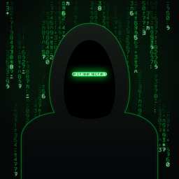

  
  &nbsp;

<picture>
  <source media="(prefers-color-scheme: dark)" srcset="assets/wordmark-dark@2x.png">
  
</picture>

**Small, careful Mac apps.** Free and native, and they collect nothing — no accounts, no analytics, no telemetry; the only
network activity is an optional update check here on GitHub. All of them at **[cyborgfingers.github.io](https://cyborgfingers.github.io/)**.

 

| | | | |
| :--- | :--- | :--- | :--- |
|  | **[SleepLess](https://github.com/CyborgFingers/SleepLess)** Keep your Mac awake — lid open or closed. | [Download for Mac](https://github.com/CyborgFingers/SleepLess/releases/latest/download/SleepLess.dmg) | [Site](https://cyborgfingers.github.io/SleepLess/) |
|  | **[JuiceLeft](https://github.com/CyborgFingers/JuiceLeft)** Know exactly how much juice is left. | [Download for Mac](https://github.com/CyborgFingers/JuiceLeft/releases/latest/download/JuiceLeft.dmg) | [Site](https://cyborgfingers.github.io/JuiceLeft/) |
|  | **JotPad** Write it down. Nothing in the way. | *Coming soon* | |

All apps: free · macOS 13+ · Apple Silicon · all rights reserved. Each app's licence and privacy notes are in its repository.

© 2026 CyborgFingers
